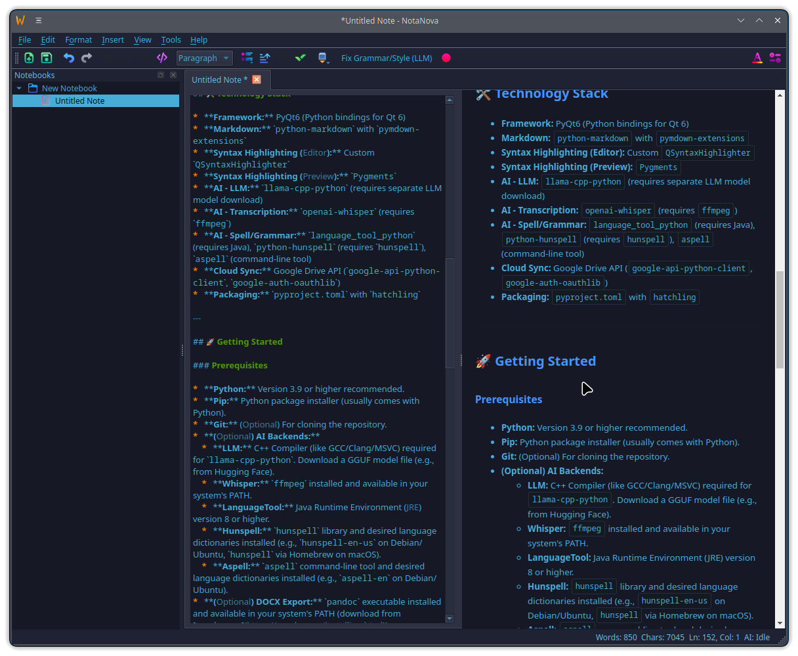

# NotaNova 🚀📝✨

**NotaNova** is an AI-Powered, cross-platform Markdown note-taking application built with Python and PyQt6. It aims to provide a seamless experience for creating, organizing, and enhancing your notes with modern features.



---

## 🌟 Key Features

*   **✍️ Rich Markdown Editing:**
    *   Live preview panel updates as you type.
    *   Syntax highlighting in the editor.
    *   Full formatting support (bold, italic, lists, blockquotes, etc.).
    *   Easy insertion of tables, images, links, code blocks, and more via toolbar/menu.
*   **📚 Notebook Organization:**
    *   Tabbed interface for managing multiple notes.
    *   Hierarchical notebook tree view with drag-and-drop support.
    *   Create, rename, and delete notes and notebooks.
*   **🧠 AI Integration:**
    *   **Fix Text:** Use a local LLM (via `llama-cpp-python`) to correct grammar, improve style, and enhance clarity in your notes.
    *   **Transcribe:** Record audio directly within the app and transcribe it to text using OpenAI's Whisper.
    *   **Spell & Grammar Check:** Integrated checker supporting multiple backends (LanguageTool, Hunspell, Aspell - requires setup).
*   **☁️ Cloud Sync (Google Drive):**
    *   Authenticate with your Google account.
    *   List recent Markdown/text files from Google Drive.
    *   Download Drive files directly into NotaNova.
    *   Upload notes from NotaNova to your Google Drive.
*   **🎨 Customization & Appearance:**
    *   Switch between **Light** and **Dark** themes.
    *   Configure editor font family and size.
    *   Modern UI styled with QSS.
*   **📤 Export Options:**
    *   Export notes to various formats:
        *   `.md` (Markdown)
        *   `.html` (Standalone HTML with embedded styles)
        *   `.pdf` (High-quality PDF via Qt's print support)
        *   `.docx` (Microsoft Word - requires `pandoc`)
*   **⚙️ Robust & User-Friendly:**
    *   Configurable **autosave** interval.
    *   **Session restore:** Reopens previously open tabs on startup.
    *   **Single instance** check prevents multiple copies running.
    *   Safe file deletion using system **trash** (`send2trash`).
    *   Crash logging for easier debugging.

---

## 🛠️ Technology Stack

*   **Framework:** PyQt6 (Python bindings for Qt 6)
*   **Markdown:** `python-markdown` with `pymdown-extensions`
*   **Syntax Highlighting (Editor):** Custom `QSyntaxHighlighter`
*   **Syntax Highlighting (Preview):** `Pygments`
*   **AI - LLM:** `llama-cpp-python` (requires separate LLM model download)
*   **AI - Transcription:** `openai-whisper` (requires `ffmpeg`)
*   **AI - Spell/Grammar:** `language_tool_python` (requires Java), `python-hunspell` (requires `hunspell`), `aspell` (command-line tool)
*   **Cloud Sync:** Google Drive API (`google-api-python-client`, `google-auth-oauthlib`)
*   **Packaging:** `pyproject.toml` with `hatchling`

---

## 🚀 Getting Started

### Prerequisites

*   **Python:** Version 3.9 or higher recommended.
*   **Pip:** Python package installer (usually comes with Python).
*   **Git:** (Optional) For cloning the repository.
*   **(Optional) AI Backends:**
    *   **LLM:** C++ Compiler (like GCC/Clang/MSVC) required for `llama-cpp-python`. Download a GGUF model file (e.g., from Hugging Face).
    *   **Whisper:** `ffmpeg` installed and available in your system's PATH.
    *   **LanguageTool:** Java Runtime Environment (JRE) version 8 or higher.
    *   **Hunspell:** `hunspell` library and desired language dictionaries installed (e.g., `hunspell-en-us` on Debian/Ubuntu, `hunspell` via Homebrew on macOS).
    *   **Aspell:** `aspell` command-line tool and desired language dictionaries installed (e.g., `aspell-en` on Debian/Ubuntu).
*   **(Optional) DOCX Export:** `pandoc` executable installed and available in your system's PATH (download from [pandoc.org](https://pandoc.org/installing.html)).
*   **(Optional) Google Drive Sync:** A Google Account and credentials file (`client_secret.json`) obtained from Google Cloud Console.

### Installation & Setup

1.  **Clone the Repository:**
    ```bash
    git clone https://github.com/yourusername/notanova.git # Replace with your repo URL
    cd notanova
    ```
    *(Alternatively, download and extract the source code)*

2.  **Create a Virtual Environment (Recommended):**
    ```bash
    python -m venv venv
    # Activate the environment:
    # Windows:
    # .\venv\Scripts\activate
    # macOS/Linux:
    # source venv/bin/activate
    ```

3.  **Install Base Dependencies:**
    ```bash
    pip install -r requirements.txt
    # Or using pyproject.toml:
    # pip install .
    ```

4.  **Install Optional Dependencies (As Needed):**

    *   **All AI Features:**
        ```bash
        pip install .[ai]
        # Note: llama-cpp-python might require specific build flags. See its documentation.
        # Example with Metal support on macOS:
        # CMAKE_ARGS="-DLLAMA_METAL=on" pip install llama-cpp-python --force-reinstall --no-cache-dir
        ```
    *   **DOCX Export:**
        ```bash
        pip install .[export]
        # Remember to install pandoc separately!
        ```
    *   **All Optional Features:**
        ```bash
        pip install .[full]
        ```

5.  **Initial Configuration (Important!):**

    *   **Google Drive:**
        1.  Go to the [Google Cloud Console](https://console.cloud.google.com/).
        2.  Create a new project (or select an existing one).
        3.  Enable the **Google Drive API**.
        4.  Go to "Credentials", create an **OAuth 2.0 Client ID** for a **Desktop app**.
        5.  Download the credentials file (`client_secret.json`).
        6.  Run NotaNova, go to `File` -> `Settings` -> `Cloud Sync`.
        7.  Click "Browse..." next to "Client Secret Path" and select your downloaded `client_secret.json` file.
        8.  Click "Apply" or "OK".
        9.  Use the `File` -> `Cloud Sync` -> `Authenticate Google Drive` menu item to log in for the first time.
    *   **Local LLM:**
        1.  Download a compatible LLM in GGUF format (e.g., from [Hugging Face TheBloke profile](https://huggingface.co/TheBloke)). Choose a model suitable for instruction following and text editing.
        2.  Run NotaNova, go to `File` -> `Settings` -> `AI Tools`.
        3.  Click "Browse..." next to "Model Path" and select your downloaded `.gguf` file.
        4.  Click "Apply" or "OK".
    *   **Whisper Model:** Select the desired model size in `Settings` -> `AI Tools`. The first time you use transcription, the selected model will be downloaded automatically (requires internet connection).
    *   **Spell Check Engine:** Select your preferred engine in `Settings` -> `AI Tools`. Ensure the corresponding prerequisites (Java, Hunspell/Aspell + Dictionaries) are installed. Set the correct language code in `Settings` -> `Editor`.

### Running NotaNova

Once dependencies are installed and configurations are set:

```bash
python notanova/notanova.py
```
